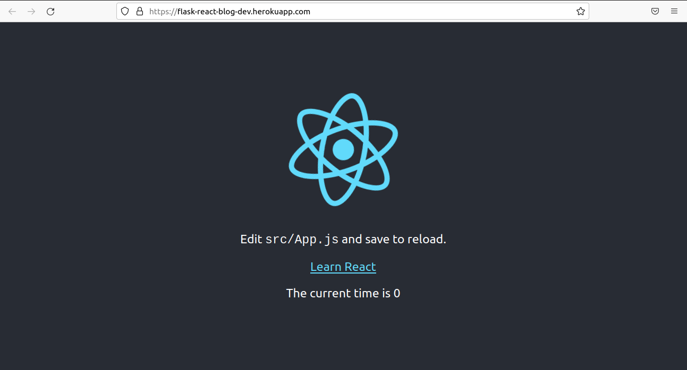

# Flask React Blog
> This is a simple Blog built with React and Flask.

[](https://flask-react-blog-dev.herokuapp.com/)
[![security: bandit][bandit-image]][bandit-url]
[![Imports: isort][isort-image]][isort-url]
[![Flask React Blog Feature Development Build][feature-development-image]][feature-development-url]
[![Flask React Blog Development Build][development-image]][development-url]
[![Flask React Blog Staging Build][staging-image]][staging-url]
[![Flask React Blog Production Build][staging-image]][production-url]
[![Flask React Blog Production Build][production-image]][production-url]
[](https://www.python.org/)
[](https://github.com/Naereen/StrapDown.js/blob/master/LICENSE)

This Blog app enables a blogger to add new blog posts or view published blog posts.



## Installation

### Clone the [Flask React Blog repo](https://github.com/twyle/flask-react-blog-simple.git)

```sh
git clone https://github.com/twyle/flask-react-blog-simple.git
```

### Navigate into the cloned repo

```sh
cd flask-react-blog-simple
```

### Create a Python3 Virtual Environment.

OS X & Linux:

```sh
python3 -m venv venv
```

Windows:

```sh
python3 -m venv venv
```

### Activate the Virtual Environment.

OS X & Linux:

```sh
source venv/bin/activate
```

Windows:

```sh
venv\\Scripts\\Activate
```

### Install the Project dependencies.

```sh
make install
```

### Run the application.

```sh
make run
```

## Usage example

A few motivating and useful examples of how your product can be used. Spice this up with code blocks and potentially more screenshots.

_For more examples and usage, please refer to the [Wiki][wiki]._

## Development setup

Here is how to setup your development environment incase you want to play around with this project.

### Install the development dependencies (make sure you have set up the virtual environment as stated above and are in the project folder)

```sh
make install-dev
```

### Run the unit tests

```sh
make test
```

## Release History

## v0.2.0 (2022-04-06)

### Feat

- added the front-end.

## v0.1.0 (2022-04-06)

### Fix

- fixed the tag versioning.
- fixed the workflow deployments.
- added the app-dir directive.

### Feat

- added new divide functionality
- added the header photo.
- renamed the workflows.
- initial commit.


## Meta

Lyle Okoth – [@lylethedesigner](https://twitter.com/lylethedesigner) on twitter – [lyle okoth](https://medium.com/@lyle-okoth) on medium, and my email is lyceokoth@gmail.com

Distributed under the MIT license. See ``LICENSE`` for more information.

[https://github.com/twyle/github-link](https://github.com/twyle/)

## Contributing

1. Fork it https://github.com/twyle/flask-react-blog-simple/fork
2. Create your feature branch (`git checkout -b feature/fooBar`)
3. Commit your changes (`git commit -am 'Add some fooBar'`)
4. Push to the branch (`git push origin feature/fooBar`)
5. Create a new Pull Request

<!-- Markdown link & img dfn's -->
[wiki]: https://github.com/yourname/yourproject/wiki

[bandit-image]: https://img.shields.io/badge/security-bandit-yellow.svg
[bandit-url]: https://github.com/PyCQA/bandit

[isort-image]: https://img.shields.io/badge/%20imports-isort-%231674b1?style=flat&labelColor=ef8336
[isort-url]: https://pycqa.github.io/isort/

[feature-development-image]: https://github.com/twyle/flask-react-blog-simple/actions/workflows/feature-development-workflow.yml/badge.svg?branch=feature%2Fworkflows
[feature-development-url]: https://github.com/twyle/flask-react-blog-simple/actions/workflows/feature-development-workflow.yml

[development-image]: https://github.com/twyle/flask-react-blog-simple/actions/workflows/development-workflow.yml/badge.svg
[development-url]: https://github.com/twyle/flask-react-blog-simple/actions/workflows/development-workflow.yml

[staging-image]: https://github.com/twyle/flask-react-blog-simple/actions/workflows/staging-workflow.yml/badge.svg
[staging-url]: https://github.com/twyle/flask-react-blog-simple/actions/workflows/staging-workflow.yml

[production-image]: https://github.com/twyle/flask-react-blog-simple/actions/workflows/production-workflow.yml/badge.svg
[production-url]: https://github.com/twyle/flask-react-blog-simple/actions/workflows/production-workflow.yml
